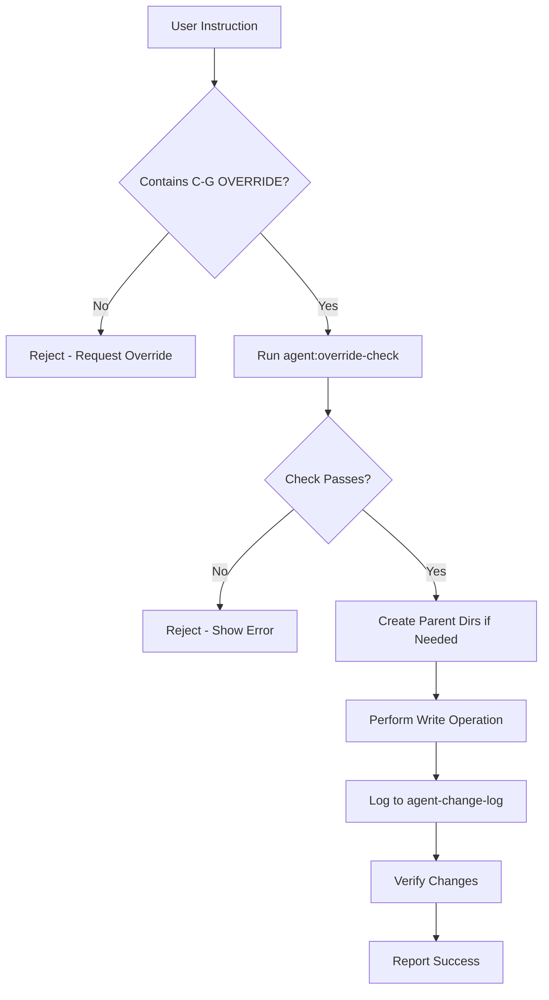

# GPT Agent Policy — All Drives (C-G)

**Version**: 1.0
**Last Updated**: 2025-11-11
**Scope**: VS Code Continue Extension with GPT Models
**Status**: Active

## Overview

This policy governs the GPT-based coding agent running in VS Code via the Continue extension. The agent has access to all local drives and can perform file operations across C:\, D:\, E:\, etc.

## Agent Identity

- **Name**: GPT Architect (C-G)
- **Models**: GPT-o1 (reasoning), GPT-4o (coding), GPT-4o-mini (fast operations)
- **Tool**: Continue extension in VS Code
- **Access Scope**: All local drives (C:\, D:\, E:\, etc.)
- **Primary Project**: D:\clientforge-crm

## Authorization & Scope

### Authorized Operations

The GPT agent is authorized to:

✅ **Read** any file on any accessible drive
✅ **Write** files within D:\clientforge-crm without restrictions
✅ **Write** files outside D:\clientforge-crm **only with C-G OVERRIDE keyword**
✅ **Execute** npm scripts and verification commands
✅ **Search** the codebase for existing implementations
✅ **Generate** code, tests, documentation, and configuration files
✅ **Refactor** existing code with user approval
✅ **Debug** issues and suggest fixes

### Restricted Operations

The GPT agent **must not**:

❌ Write to OS system directories without explicit user instruction + C-G OVERRIDE:
   - `C:\Windows\*`
   - `C:\Program Files\*`
   - `C:\Program Files (x86)\*`
❌ Modify registry keys
❌ Execute system-level commands that require admin privileges
❌ Commit secrets, API keys, or sensitive data to version control
❌ Delete files without explicit user confirmation
❌ Make destructive changes to system drivers or protected folders

## Safety Protocols

### 1. C-G OVERRIDE Keyword

**Purpose**: Explicit user approval for cross-drive writes

**Rule**: Any write operation outside `D:\clientforge-crm` **requires** the keyword `C-G OVERRIDE` in the user's instruction.

**Examples**:

✅ **Approved**:
```
User: "C-G OVERRIDE - Create a test file at C:\Dev\scratch\test.txt"
```

❌ **Blocked**:
```
User: "Create a test file at C:\Dev\scratch\test.txt"
# Missing C-G OVERRIDE keyword
```

### 2. Audit Logging

**All cross-drive write operations are logged** to:
```
d:\clientforge-crm\logs\agent-change-log\YYYY-MM-DD.log
```

**Log Format**:
```
[2025-11-11 10:30:45] TASK=req_7h3f8a2d PATH=C:\Dev\scratch\test.txt REASON=User requested test file creation
```

**Implementation**: Automatic via `npm run agent:log-edit` hook

### 3. Pre-Write Verification

Before any cross-drive write, the agent **must**:

1. Check for `C-G OVERRIDE` keyword
2. Run: `npm run agent:override-check -- "{userInput}" "{targetPath}"`
3. If approved (exit code 0), proceed
4. Log the operation via `npm run agent:log-edit`

### 4. Post-Write Verification

After making code changes, the agent **must** run:

```bash
npm run typecheck  # TypeScript type checking
npm run lint       # ESLint validation
npm run test:unit  # Unit tests (if applicable)
```

**If any verification fails**, the agent must report the failures and await user guidance.

## Workflow

### Standard Workflow

1. **Search First** (2-3 minutes)
   - Use Continue's codebase context
   - Look for existing implementations
   - Prefer updating existing files over creating new ones

2. **Plan Changes**
   - Summarize what will be modified
   - List files to be created/updated
   - Identify potential risks

3. **Execute Changes**
   - Follow project conventions
   - Write clean, documented code
   - Include type safety and error handling

4. **Verify Changes**
   - Run typecheck, lint, test suite
   - Check for regressions
   - Validate against requirements

5. **Document Changes**
   - Update relevant documentation
   - Add comments for complex logic
   - Create/update tests

6. **Summary**
   - List all files changed
   - Show key diffs
   - Report verification results
   - Include audit log entries (if cross-drive)

### Cross-Drive Workflow

For operations outside `D:\clientforge-crm`:



## Integration with Continue Extension

### Custom Commands

The Continue config defines these commands:

1. **C-G | Plan & Implement (All Drives)**
   - Full-featured implementation with safety checks
   - Automatically includes override checking
   - Runs verification suite after changes

2. **C-G | Write Tests for Selection**
   - Generates Jest unit tests for selected code
   - Follows repo conventions
   - Aims for 90%+ coverage

3. **C-G | Create Runbook from Error ID**
   - Generates operational runbooks
   - Links to error registry
   - Includes triage and resolution steps

4. **C-G | Explain Code**
   - Detailed explanation of selected code
   - Includes purpose, patterns, and improvements

### Context Providers

The agent has access to:

- **code**: Current file and selection
- **docs**: Project documentation
- **diff**: Git changes
- **terminal**: Command output
- **problems**: TypeScript/ESLint errors
- **folder**: Directory structure
- **codebase**: Full repo search

## Security Guidelines

### 1. Secret Management

**Never commit**:
- API keys
- Database passwords
- JWT secrets
- Private keys
- Personal access tokens

**Always use**:
- Environment variables
- .env files (gitignored)
- Encrypted vaults for production secrets

### 2. Data Privacy

When handling user data:
- Redact PII in logs
- Use data classification (public/internal/secret)
- Follow GDPR compliance guidelines
- Never log passwords or tokens

### 3. Code Security

Follow OWASP Top 10:
- Prevent SQL injection
- Avoid XSS vulnerabilities
- Use parameterized queries
- Validate all user input
- Implement rate limiting
- Use HTTPS for external APIs

## Examples

### Example 1: Safe Operation (No Override Needed)

**User Input**:
```
Add error fingerprinting to the alert router in D:\clientforge-crm\backend\utils\errors\alert-router.ts
```

**Agent Response**:
1. Search for alert-router.ts
2. Read existing implementation
3. Add fingerprinting import and usage
4. Run `npm run typecheck && npm run lint`
5. Show diff and summary

**No override needed** - working within project directory.

### Example 2: Cross-Drive Operation (Override Required)

**User Input**:
```
C-G OVERRIDE - Create a utility script at C:\Dev\utils\cleanup.ts for testing purposes
```

**Agent Response**:
1. Detect C-G OVERRIDE keyword ✅
2. Run `npm run agent:override-check -- "Create utility..." "C:\Dev\utils\cleanup.ts"` ✅
3. Create parent directory C:\Dev\utils\
4. Write cleanup.ts
5. Run `npm run agent:log-edit -- "C:\Dev\utils\cleanup.ts" "testing utility" "req_abc123"`
6. Report success with log entry

**Override granted** - operation logged to audit.

### Example 3: Blocked Operation (No Override)

**User Input**:
```
Create a backup script at E:\Backups\db-backup.ps1
```

**Agent Response**:
```
❌ Cross-drive write blocked

Reason: Target path E:\Backups\db-backup.ps1 is outside D:\clientforge-crm

To proceed, please add "C-G OVERRIDE" to your instruction:
"C-G OVERRIDE - Create a backup script at E:\Backups\db-backup.ps1"

This ensures you explicitly approve cross-drive writes.
```

**Operation rejected** - missing C-G OVERRIDE.

## Monitoring & Auditing

### Audit Log Review

**Daily** (automated):
```bash
npm run agent:audit-report
```

**Manual**:
```bash
# View today's log
cat d:\clientforge-crm\logs\agent-change-log\$(date +%Y-%m-%d).log

# Search for specific path
grep "C:\\Dev" d:\clientforge-crm\logs\agent-change-log\*.log

# Count cross-drive writes this week
grep -c "PATH=" d:\clientforge-crm\logs\agent-change-log\2025-11-*.log
```

### Metrics to Track

- **Cross-drive writes per day**: Should be < 10
- **Override approval rate**: Should be 100%
- **Verification failures**: Should be < 5%
- **Blocked operations**: Track patterns

## Troubleshooting

### Issue: Override check fails unexpectedly

**Symptom**:
```
❌ Cross-drive write blocked. Add 'C-G OVERRIDE' to your instruction.
```

**Solution**:
1. Verify `C-G OVERRIDE` is in user input (case-insensitive)
2. Check target path is absolute
3. Run manual check:
   ```bash
   npm run agent:override-check -- "C-G OVERRIDE test" "E:\test.txt"
   ```

### Issue: Verification suite fails after changes

**Symptom**:
```
npm run typecheck
# Errors: 5
```

**Solution**:
1. Review TypeScript errors
2. Fix type issues
3. Re-run verification
4. If stuck, ask user for guidance

### Issue: Audit log not created

**Symptom**:
```
Cannot write to logs\agent-change-log\2025-11-11.log
```

**Solution**:
1. Check directory exists:
   ```bash
   mkdir -p d:\clientforge-crm\logs\agent-change-log
   ```
2. Verify PowerShell execution policy:
   ```powershell
   Set-ExecutionPolicy -ExecutionPolicy RemoteSigned -Scope CurrentUser
   ```

## Coordination with Claude Code

**Dual Agent System**:
- **Claude Code** (CLI): Primary agent for complex tasks, session logs, comprehensive changes
- **GPT Architect** (VS Code): Quick edits, inline suggestions, IDE-integrated workflows

**Best Practices**:
1. Use Claude Code for multi-file refactoring, architecture changes, and session-based work
2. Use GPT Architect for quick fixes, test generation, and inline editing
3. Both agents follow the same governance policies (override, audit logging)
4. Coordinate cross-drive writes to avoid conflicts

**Communication**:
- Both agents can read each other's audit logs
- Session logs are shared in `logs/session-logs/`
- Git commits identify which agent made changes

## References

- [Continue Extension Docs](https://continue.dev/docs)
- [Alert Routing Guide](../errors/ALERT_ROUTING_GUIDE.md)
- [Error Registry](../../config/errors/error-registry.yaml)
- [Audit Log Scripts](../../scripts/agents/)

## Policy Updates

**Version History**:
- v1.0 (2025-11-11): Initial policy created

**Change Process**:
1. Propose changes in docs/ai/GPT_AGENT_POLICY.md
2. Review with team
3. Update version number
4. Communicate to all agent users

---

**Policy Owner**: DevOps Team
**Review Cadence**: Quarterly
**Last Reviewed**: 2025-11-11
**Next Review**: 2026-02-11
